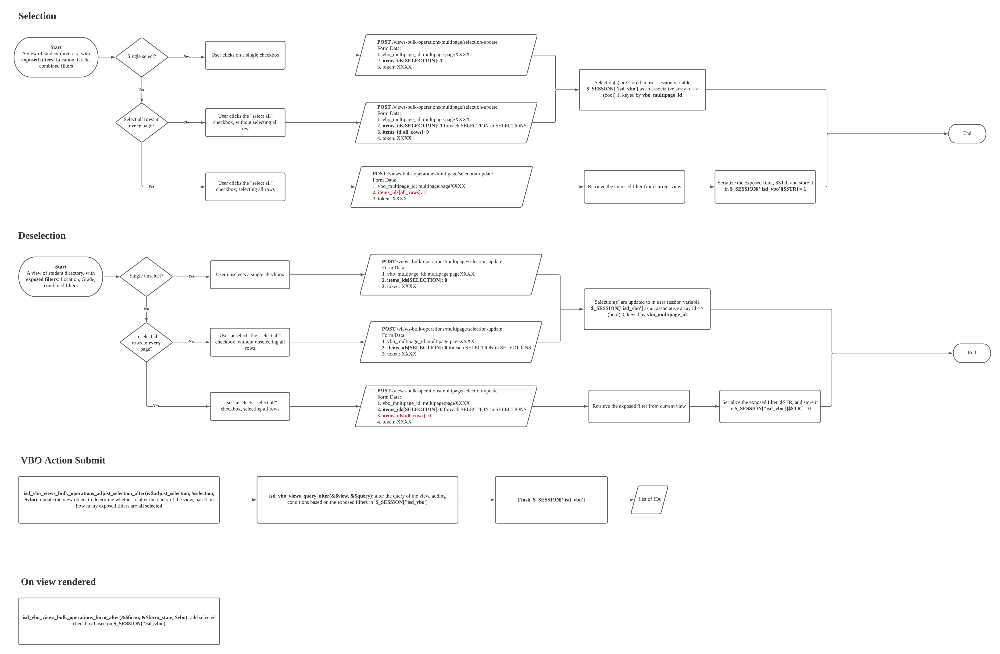

# Custom VBO

## Diagram



## Details

1. When all\_row is set, we need to store the exposed filters in session

   views-bulk-operations/multipage/selection-update page callback isd\_vbo\_update\_selection\_ajax

   The $\_POST\['item\_ids'\] is 

   ```php
   Array
   (
       [all_rows] => 1
   )
   ```

   We need to only update the current exposed filters to 1, which will be later joined by OR condition in query

2. However, the view object is not preserved in this endpoint
   1. ctools object cache API drupal 7
   2. [https://api.drupal.org/api/ctools/includes%21object-cache.inc/function/ctools\_object\_cache\_get/7.x-1.x](https://api.drupal.org/api/ctools/includes%21object-cache.inc/function/ctools_object_cache_get/7.x-1.x)
   3.   ```text
      function ctools_object_cache_set($obj, $name, $cache, $sid = NULL) {
      ```


Where can we access the view object? `isd_vbo_views_bulk_operations_form_alter`

How can we map the exposed filters? in the hash function `isd_vbo_get_selection_id` `isd_vbo_get_normalized_exposed_filters`

Used ctools to store the options and filters, but the filters is hashed.

Need a reverse mapping from hashed id to filters

Hashing:

```php
foreach ($view->filter as $name => $filter) {
  // dpm($name);
  // dpm($filter);
  if ($filter->is_exposed()) {
    $exposed_filters[$filter->options['expose']['identifier']] = $name;
  }
}
 // Normalize the exposed filter values.
$exposed_input = array_intersect_key($view->get_exposed_input(), $exposed_filters);
$exposed_input = array_filter($exposed_input, function ($value) {
  return $value !== 'All';
});
ksort($exposed_input);f

```

## View

1129

```php
public function _build($key) {
    $handlers = &$this->$key;
    dpm($handlers);
    dpm($key);
    foreach ($handlers as $id => $data) {

      if (!empty($handlers[$id]) && is_object($handlers[$id])) {
        $multiple_exposed_input = array(0 => NULL);
        if ($handlers[$id]->multiple_exposed_input()) {
          $multiple_exposed_input = $handlers[$id]->group_multiple_exposed_input($this->exposed_data);
        }
        foreach ($multiple_exposed_input as $group_id) {
          // Give this handler access to the exposed filter input.
          if (!empty($this->exposed_data)) {
            $converted = FALSE;
            if ($handlers[$id]->is_a_group()) {
              $converted = $handlers[$id]->convert_exposed_input($this->exposed_data, $group_id);
              $handlers[$id]->store_group_input($this->exposed_data, $converted);
              if (!$converted) {
                continue;
              }
            }
            $rc = $handlers[$id]->accept_exposed_input($this->exposed_data);
            $handlers[$id]->store_exposed_input($this->exposed_input, $rc);
            if (!$rc) {
              continue;
            }
          }
          $handlers[$id]->set_relationship();
          $handlers[$id]->query($this->display_handler->use_group_by());
        }
      }
    }
  }
  
```

## view\_handler\_filter

```php

  /**
   * Transform the input from a grouped filter into a standard filter.
   *
   * When a filter is a group, find the set of operator and values that the
   * choosen item represents, and inform views that a normal filter was
   * submitted by telling the operator and the value selected.
   *
   * The param $selected_group_id is only passed when the filter uses the
   * checkboxes widget, and this function will be called for each item choosen
   * in the checkboxes.
   */
  public function convert_exposed_input(&$input, $selected_group_id = NULL) {
    if ($this->is_a_group()) {
      // If it is already defined the selected group, use it. Only valid when
      // the filter uses checkboxes for widget.
      if (!empty($selected_group_id)) {
        $selected_group = $selected_group_id;
      }
      else {
        $selected_group = $input[$this->options['group_info']['identifier']];
      }
      if ($selected_group == 'All' && !empty($this->options['group_info']['optional'])) {
        return NULL;
      }
      if ($selected_group != 'All' && empty($this->options['group_info']['group_items'][$selected_group])) {
        return FALSE;
      }
      if (isset($selected_group) && isset($this->options['group_info']['group_items'][$selected_group])) {
        $input[$this->options['expose']['operator']] = $this->options['group_info']['group_items'][$selected_group]['operator'];

        // Value can be optional, For example for 'empty' and 'not empty'
        // filters.
        if (!empty($this->options['group_info']['group_items'][$selected_group]['value'])) {
          $input[$this->options['expose']['identifier']] = $this->options['group_info']['group_items'][$selected_group]['value'];
        }
        $this->options['expose']['use_operator'] = TRUE;

        $this->group_info = $input[$this->options['group_info']['identifier']];
        return TRUE;
      }
      else {
        return FALSE;
      }
    }
  }
  
```

## Exclude a field from display in pre-render



```php
 // Exclude from display in pre-render
  $fields = $view->display_handler->get_option('fields');
  foreach($fields as $name => &$field) {
    if ($field['field'] != $view->base_field) {
      // dpm($field['field']);
      $fields[$field['field']]['exclude'] = TRUE;
      // dpm($fields);
    }
  }
```

## Remove a field from select projection



```php


function isd_vbo_views_pre_build(&$view)
{
  if (isset($view->isd_vbo)) {

    // dpm($view);
    // foreach($view->field as $name => &$field) {
    //   if ($name != $view->base_field) {
    //     unset($view->field[$name]);
    //     unset($view->display_handler->handlers['field'][$name]);
    //   }
    // }
  }
}

```

Note: base\_field is defaulted to be nid of node entity in this hook. Not working


```php
function mymodule_views_pre_build(&$view) {
  if ($view->name == 'campaign_report'
      && $view->current_display == 'views_data_export_1') {

    // You'll have your own list of fields to remove that you create somehow...
    $fields_to_remove = array('field_name_to_remove_1','field_name_to_remove_2');

    foreach ($fields_to_remove as $field_name) {
      unset($view->field[$field_name]);            
      unset($view->display_handler->handlers['field'][$field_name]);  
    }
  }
}
```

## Nested conditions

The below is not working for views\_plugin\_query\_default

```php
$query
  ->condition('field1', array(1, 2), 'IN')
  ->condition(db_or()->condition('field2', 5)->condition('field3', 6))
```

But this one works:

```php
$this->query
  ->add_where($this->options['group'], db_or()
  ->condition($field, $value, 'NOT IN')
  ->condition($field, $value, 'IS NULL'));
```

## Only select certain fields

```php

dpm($view->field);
Only select the id field
// Exclude from display in pre-render
$fields = $view->display_handler->get_option('fields');
foreach($fields as $name => &$field) {
  if ($field['field'] != $view->base_field) {
    // dpm($field['field']);
    $fields[$field['field']]['exclude'] = TRUE;
    // dpm($fields);
  }
}
$query->fields['sbb'] = array(
  'field' => 'mail',
  'table' => $view->base_table,
  'alias' => 'sbb',
);
foreach ($view->field as $name => &$field) {
  if ($name != $view->base_field) {
    dd($name);
    unset($view->field[$name]);
    unset($view->display_handler->handlers['field'][$name]);
  }
}
dpm($view->field);
```

## Custom field handler builder

```php

$handlers = &$view->filter;
foreach($handlers as $id => $data) {
  if (!empty($handlers[$id]) && is_object($handlers[$id])) {
    $multiple_exposed_input = array(0 => NULL);
    if ($handlers[$id]->multiple_exposed_input()) {
      $multiple_exposed_input = $handlers[$id]->group_multiple_exposed_input($view->exposed_data);
    }
    foreach ($multiple_exposed_input as $group_id) {
      // Give this handler access to the exposed filter input.
      if (!empty($view->exposed_data)) {
        $converted = FALSE;
        if ($handlers[$id]->is_a_group()) {
          $converted = $handlers[$id]->convert_exposed_input($view->exposed_data, $group_id);
          $handlers[$id]->store_group_input($view->exposed_data, $converted);
          if (!$converted) {
            continue;
          }
        }
        $rc = $handlers[$id]->accept_exposed_input($view->exposed_data);
        // $handlers[$id]->store_exposed_input($view->exposed_input, $rc);
        if (!$rc) {
          continue;
        }
      }
      $handlers[$id]->set_relationship();
      $handlers[$id]->query($view->display_handler->use_group_by());
    }
  }
}
```

## Custom VBO query steps

### Store user selection

1. Store the hashes of exposed filters in session, e.g., 

   1. the filter \(users.uid NOT IN \[1,2\] AND users.status = 0\) has hash A
   2. the filter \(users.uid NOT IN \[1,2\] AND users.status = 1\) has hash B
   3. the filter \(combine = 'a' AND users.status = 1\) has hash C

   These hashes are stored in `CTOOLS_CACHE[view_name:display_name]['filters']`

   _The value should be set to TRUE only when the user selects all rows in all pages_

2. Store the options of the custom VBO modules. 3 important ones are

   1. multipage: whether the multipage option is enabled in VBO. **Should be 1.**
   2. multipage\_ignore\_exposed\_filters: whether to disable select\_all in exposed filters. **Should be 0.**
   3. multipage\_union\_exposed\_filters: whether to union all the exposed together in query. **Should be 1**

   These options are stored in $\_SESSION\[view\_name:display\_name\]\['options'\]

3. Store the mapping of exposed\_filter hashing in `CTOOLS_CACHE[view_name:display_name:filters]`
4. Store individual selections in `$_SESSION['isd_vbo'][view_name:display_name]`

### Rendering checkboxes

1. Create a dummy view
2. Alter the query: \(ORIGINAL\_CONDITION **AND** CURRENT\_EXPOSED\_FILTER\) AND \(EXPOSED\_FILTER1 OR EXPOSED\_FILTER2\), e.g., \(O && C\) && \(E1 \|\| E2 \|\| E3\)
3. Distribution and reorder: 
   1. \(O && C\) && \(E1 \|\| E2 \|\| E3\)
   2. \(O && C && E1\) \|\| \(O && C && E2\) \|\| \(O && C && E3\)
4. So we need to
   1. Set the current exposed filter retrieved from the current hash in `hook_views_pre_execute`
   2. Alter the views query in `hook_views_query_alter`
      1. Save and clone the old query conditions
      2. For each exposed filters whose hash is set to TRUE
         1. Retrieve its exposed\_input
         2. Override the exposed\_data and exposed\_input in the dummy view
         3. Run the internal `_built` function with argument `filters` to build the query for the injected exposed filters, for different handler types
         4. Concat the newly created `view_plugin_query_default` condition with the cloned original query conditions
      3. OR join the filter groups
   3. Feed in the 10/20 ids of current page using another AND condition to only select the matched ids in the current page
   4. Execute the dummy view
   5. Get the result and populate the checkboxes

Before the dummy view, another loop on the current page result will be execute to compare the checkbox real\_field with those individual IDs store in session.

### Submitting data

TBD


## TRUE singleton

```php
$new_where[] = array(
  'conditions' => array(
    array(
      'field' => TRUE,
      'value' => array(),
      'operator' => 'formula',
    ),
  ),
  'args' => array(),
  'type' => 'AND',
);

// $query->add_where_expression(0, "TRUE");
// dpm($query);
```

Reason for that: `views_plugin_query_default`:1148

```php
if (!empty($info['conditions'])) {
        $sub_group = $info['type'] == 'OR' ? db_or() : db_and();
        foreach ($info['conditions'] as $key => $clause) {
          // DBTNG doesn't support to add the same subquery twice to the main
          // query and the count query, so clone the subquery to have two
          // instances of the same object.
          // @see http://drupal.org/node/1112854
          if (is_object($clause['value']) && $clause['value'] instanceof SelectQuery) {
            $clause['value'] = clone $clause['value'];
          }
          if ($clause['operator'] == 'formula') {
            $has_condition = TRUE;
            $sub_group->where($clause['field'], $clause['value']);
          }
          else {
            $has_condition = TRUE;
            $sub_group->condition($clause['field'], $clause['value'], $clause['operator']);
          }
        }
```

## Or not working



## Limit and offset in view's build\_info

```php
if (!$get_count) {
      if (!empty($this->limit) || !empty($this->offset)) {
        // We can't have an offset without a limit, so provide a very large
        // limit instead.
        $limit  = intval(!empty($this->limit) ? $this->limit : 999999);
        $offset = intval(!empty($this->offset) ? $this->offset : 0);
        $query->range($offset, $limit);
      }
    }
    
```

## Custom plugin



## Build condition

 The function that built the query in views\_plugin\_query\_default

```php
/**
 * Construct the "WHERE" or "HAVING" part of the query.
 *
 * As views has to wrap the conditions from arguments with AND, a special
 * group is wrapped around all conditions. This special group has the ID 0.
 * There is other code in filters which makes sure that the group IDs are
 * higher than zero.
 *
 * @param string $where
 *   Either 'where' or 'having'.
 */
public function build_condition($where = 'where')
```

## Same pager for multiple views

```php
// If the current page number was not specified, extract it from the global
// page array.
global $pager_page_array;

if (empty($pager_page_array)) {
  $pager_page_array = array();
}

// Fill in missing values in the global page array, in case the global page
// array hasn't been initialized before.
$page = isset($_GET['page']) ? explode(',', $_GET['page']) : array();

$pager_id = $this->get_pager_id();
for ($i = 0; $i <= $pager_id || $i < count($pager_page_array); $i++) {
  $pager_page_array[$i] = empty($page[$i]) ? 0 : $page[$i];
}

$this->current_page = intval($pager_page_array[$pager_id]);

if ($this->current_page < 0) {
  $this->current_page = 0;
}
```


