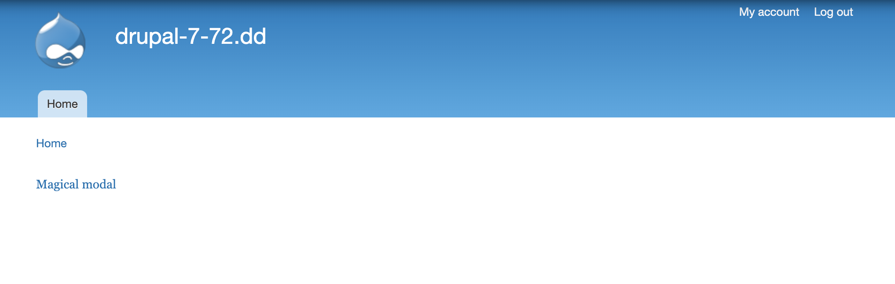

# Show form in modal popup

## Create a test menu link

Add the following entry to items


```php
$items['test'] = array(
    'page callback' => 'mymodule_page',
    'access callback' => TRUE,
    'type' => MENU_CALLBACK,
  );
```


## Create menu link for AJAX forms

Add the following entry to items


```php
$items['schools/forms/%ctools_js'] = array(
    'page callback' => 'mymodule_callback',
    'page arguments' => array(1),
    'access callback' => TRUE,
    'type' => MENU_CALLBACK,
  );
```


## Create a new .inc file for module


```php
<?php

/**
 * Helper function to make a link.
 */
function _mymodule_make_link($link_text = '')
{
  // Set a default value if no text in supplied.
  if (empty($link_text)) {
    $link_text = 'Magical Modal';
  }

  return '<div id="magical-modal-link">' . l($link_text, 'schools/forms/nojs', array('attributes' => array('class' => 'ctools-use-modal'))) . '</div>';
}

/**
 * Drupal form to be put in a modal.
 */
function mymodule_form($form, $form_state)
{
  $form = array();

  $form['new_link_text'] = array(
    '#type' => 'textfield',
    '#title' => t('Link text'),
  );

  $form['submit'] = array(
    '#type' => 'submit',
    '#value' => t('Submit'),
  );

  return $form;
}

/**
 * An example page.
 */
function mymodule_page()
{
  // Load the modal library and add the modal javascript.
  ctools_include('modal');
  ctools_modal_add_js();
  return _mymodule_make_link('Magical modal');
}

/**
 * Ajax menu callback.
 */
function mymodule_callback($ajax)
{
  if ($ajax) {
    ctools_include('ajax');
    ctools_include('modal');

    $form_state = array(
      'ajax' => TRUE,
      'title' => t('MyModule Modal Form'),
    );

    // Use ctools to generate ajax instructions for the browser to create
    // a form in a modal popup.
    $output = ctools_modal_form_wrapper('mymodule_form', $form_state);

    // If the form has been submitted, there may be additional instructions
    // such as dismissing the modal popup.
    if (!empty($form_state['ajax_commands'])) {
      $output = $form_state['ajax_commands'];
    }

    // Return the ajax instructions to the browser via ajax_render().
    print ajax_render($output);
    drupal_exit();
  } else {
    return drupal_get_form('mymodule_form');
  }
}

/**
 * Drupal form submit handler.
 */
function mymodule_form_submit(&$form, &$form_state)
{
  // Generate the new link using the submitted text value.
  $link = _mymodule_make_link($form_state['values']['new_link_text']);

  // Tell the browser to close the modal.
  $form_state['ajax_commands'][] = ctools_modal_command_dismiss();

  // Tell the browser to replace the old link with the new one.
  $form_state['ajax_commands'][] = ajax_command_replace('#magical-modal-link', $link);
}

```


Make sure to require the added module in `schools.module`

```php
require_once('schools.module.inc');
```

## Result

In `http://drupal-7-72.dd:8083/test`




Type in a new link text, e.g. `my text`


